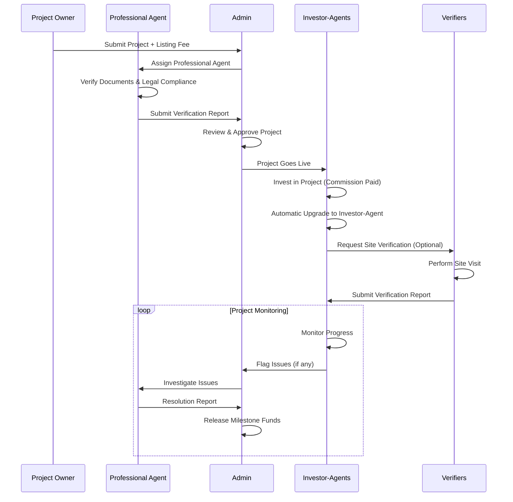

# RWA Platform: 4-Role Ecosystem Architecture

## 🎯 Ecosystem Overview

A trust-driven, transparent, and scalable investment ecosystem combining professional validation, crowd oversight, and on-demand verification with zero registration fees.

## 👥 Role Definitions

### 1. **Investor-Agents** 💰🔍
**Who**: Every investor automatically becomes an Investor-Agent (no additional fee)
**Core Function**: Invest in projects + monitor and flag suspicious activities

```typescript
interface InvestorAgent {
  capabilities: {
    // Investment Functions
    browseProjects: boolean;
    investFunds: boolean;
    portfolioManagement: boolean;
    secondaryTrading: boolean;
    
    // Agent Functions (Automatic)
    observeProjects: boolean;
    voteOnProposals: boolean;
    flagSuspiciousActivity: boolean;
    requestVerification: boolean;
    participateInGovernance: boolean;
  };
  
  fees: {
    registrationFee: 0;
    investmentCommission: "1-3%";
    verificationRequests: "Task-based fees";
  };
  
  incentives: {
    revenueSharing: boolean;
    governanceTokens: boolean;
    reputationRewards: boolean;
  };
}
```

**Key Features**:
- **Automatic Upgrade**: Every investor gets agent capabilities
- **Crowd Oversight**: Monitor investments collectively
- **Democratic Governance**: Vote on platform decisions
- **Issue Flagging**: Report suspicious activities
- **Verification Requests**: Can hire verifiers for specific checks

### 2. **Professional Agents** 🏆📋
**Who**: Certified experts (lawyers, engineers, real estate professionals)
**Core Function**: Professional verification of legal documents, asset ownership, and project milestones

```typescript
interface ProfessionalAgent {
  requirements: {
    certification: "Professional license/qualification";
    insurance: "Professional liability coverage";
    background: "Enhanced KYC + background check";
    specialization: "Real estate | Legal | Engineering | Finance";
  };
  
  capabilities: {
    documentVerification: boolean;
    legalCompliance: boolean;
    assetOwnershipValidation: boolean;
    milestoneSupervision: boolean;
    expertReports: boolean;
    disputeResolution: boolean;
  };
  
  compensation: {
    registrationFee: 0;
    commissionBased: "2-5% of project value";
    serviceFees: "Hourly/project rates";
    bonusForAccuracy: "Performance incentives";
  };
}
```

**Specializations**:
- **Legal Agents**: Contract review, compliance verification
- **Real Estate Agents**: Property valuation, ownership verification
- **Engineering Agents**: Technical feasibility, construction oversight
- **Financial Agents**: Financial model validation, due diligence

### 3. **Verifiers** 📸✅
**Who**: On-demand task workers (gig economy approach)
**Core Function**: Site visits, photo documentation, simple verification tasks

```typescript
interface Verifier {
  profile: {
    location: "Geographic availability";
    equipment: "Camera, GPS, basic tools";
    availability: "Part-time/full-time";
    rating: "Community-driven ratings";
  };
  
  tasks: {
    siteVisits: boolean;
    photoDocumentation: boolean;
    assetConfirmation: boolean;
    progressReports: boolean;
    simpleInspections: boolean;
  };
  
  compensation: {
    registrationFee: 0;
    taskBased: "$50-500 per verification";
    travelAllowance: "Distance-based compensation";
    bonusForSpeed: "Quick completion rewards";
  };
  
  requirements: {
    basicKYC: boolean;
    smartphone: boolean;
    reliableTransport: boolean;
    communicationSkills: boolean;
  };
}
```

**Task Types**:
- **Site Visits**: Physical presence confirmation
- **Photo Documentation**: Before/during/after project photos
- **Asset Verification**: Confirm asset existence and condition
- **Progress Monitoring**: Construction/development progress
- **Simple Inspections**: Basic safety and compliance checks

### 4. **Admin/Platform** ⚖️🛡️
**Who**: Platform operators and compliance team
**Core Function**: Final oversight, compliance, dispute resolution, platform management

```typescript
interface PlatformAdmin {
  responsibilities: {
    projectApproval: boolean;
    complianceOversight: boolean;
    disputeResolution: boolean;
    escrowManagement: boolean;
    regulatoryCompliance: boolean;
    platformSecurity: boolean;
  };
  
  tools: {
    adminDashboard: boolean;
    complianceMonitoring: boolean;
    fraudDetection: boolean;
    escrowControls: boolean;
    communicationTools: boolean;
  };
  
  authority: {
    projectSuspension: boolean;
    userSuspension: boolean;
    fundRelease: boolean;
    disputeArbitration: boolean;
    policyChanges: boolean;
  };
}
```

## 💰 Business Model (Zero Registration Fees)

### Revenue Streams
```typescript
interface RevenueModel {
  primaryRevenue: {
    investmentCommission: {
      rate: "1-3%";
      trigger: "When investment is made";
      payer: "Investor";
    };
    
    listingFees: {
      rate: "$1,000-10,000";
      trigger: "Project listing approval";
      payer: "Project Owner";
    };
    
    managementFees: {
      rate: "0.5-2% annually";
      trigger: "Long-term projects";
      payer: "Project Owner";
    };
  };
  
  secondaryRevenue: {
    verificationCommission: {
      rate: "10-20%";
      trigger: "Verification task completion";
      payer: "Requester (Investor-Agent)";
    };
    
    premiumFeatures: {
      rate: "$10-100/month";
      trigger: "Advanced analytics/reporting";
      payer: "Professional Agents/Large Investors";
    };
    
    secondaryTradingFees: {
      rate: "0.5-1%";
      trigger: "Token resale";
      payer: "Seller";
    };
  };
}
```

### Fee Distribution
```typescript
interface FeeDistribution {
  verificationTask: {
    verifier: "70-80%";
    platform: "15-20%";
    insurance: "5-10%";
  };
  
  investmentCommission: {
    platform: "60%";
    professionalAgent: "25%";
    insuranceFund: "10%";
    governanceRewards: "5%";
  };
  
  listingFees: {
    platform: "50%";
    complianceReview: "30%";
    marketingPromotion: "20%";
  };
}
```

## 🔄 Complete Workflow

### Project Lifecycle


### User Journey by Role
```typescript
interface UserJourneys {
  investorAgent: [
    "1. Register with basic KYC",
    "2. Browse available projects", 
    "3. Invest in projects (auto-upgrade to agent)",
    "4. Monitor investments + platform activity",
    "5. Vote on governance decisions",
    "6. Request verifications when needed",
    "7. Flag suspicious activities"
  ];
  
  professionalAgent: [
    "1. Register with professional credentials",
    "2. Complete enhanced KYC + background check",
    "3. Get certified in specialization area",
    "4. Receive project assignments",
    "5. Perform professional verification",
    "6. Submit detailed reports", 
    "7. Earn commissions + build reputation"
  ];
  
  verifier: [
    "1. Register with basic requirements",
    "2. Set geographic availability",
    "3. Receive task notifications",
    "4. Accept/decline verification tasks",
    "5. Perform site visits + documentation",
    "6. Submit reports via mobile app",
    "7. Receive task payments"
  ];
  
  admin: [
    "1. Review project submissions",
    "2. Coordinate professional agents",
    "3. Monitor platform compliance",
    "4. Resolve disputes and issues",
    "5. Manage escrow releases",
    "6. Ensure regulatory compliance"
  ];
}
```

## 🔐 Trust & Security Framework

### Multi-Layer Verification
```typescript
interface TrustFramework {
  layer1_professional: {
    agent: "Certified professional";
    scope: "Legal, technical, financial due diligence";
    timing: "Pre-listing verification";
    compensation: "Commission-based";
  };
  
  layer2_crowd: {
    agent: "Investor-Agents (crowd)";
    scope: "Ongoing monitoring, issue flagging";
    timing: "Continuous throughout project";
    compensation: "Governance rewards";
  };
  
  layer3_onDemand: {
    agent: "Task-based Verifiers";
    scope: "Specific site checks, documentation";
    timing: "On-demand when requested";
    compensation: "Task-based fees";
  };
  
  layer4_platform: {
    agent: "Admin/Platform";
    scope: "Final oversight, compliance, disputes";
    timing: "Continuous + milestone gates";
    compensation: "Platform fees";
  };
}
```

### Reputation System
```typescript
interface ReputationSystem {
  investorAgents: {
    factors: ["Investment track record", "Governance participation", "Accurate flagging"];
    benefits: ["Higher voting weight", "Premium features", "Early access"];
  };
  
  professionalAgents: {
    factors: ["Verification accuracy", "Response time", "Client satisfaction"];
    benefits: ["Higher commissions", "Priority assignments", "Specialization badges"];
  };
  
  verifiers: {
    factors: ["Task completion rate", "Report quality", "Response time"];
    benefits: ["Higher task fees", "Priority assignments", "Geographic expansion"];
  };
  
  reputationStaking: {
    mechanism: "Economic stake in reputation";
    slashing: "Penalties for poor performance";
    rewards: "Bonuses for excellence";
  };
}
```

## 📊 Platform Economics

### Economic Incentives Alignment
```typescript
interface IncentiveAlignment {
  investorAgents: {
    investment: "Direct financial stake in project success";
    monitoring: "Governance tokens for active participation";
    flagging: "Rewards for accurate issue detection";
  };
  
  professionalAgents: {
    accuracy: "Higher commissions for accurate reports";
    speed: "Bonuses for quick turnaround";
    reputation: "Long-term career benefits";
  };
  
  verifiers: {
    quality: "Rating-based fee premiums";
    availability: "Geographic exclusivity bonuses";
    speed: "Quick completion rewards";
  };
  
  platform: {
    growth: "More projects = more fees";
    trust: "Higher trust = higher project values";
    efficiency: "Automation reduces costs";
  };
}
```

### Financial Flow
```typescript
interface FinancialFlow {
  projectFunding: {
    source: "Investor-Agents";
    destination: "Escrow Account";
    trigger: "Milestone completion";
    verification: "Multi-layer validation";
  };
  
  feeCollection: {
    investment: "Automatic deduction on investment";
    verification: "Escrow release on task completion";
    listing: "Upfront payment by project owner";
    management: "Periodic automated collection";
  };
  
  payoutDistribution: {
    timing: "Real-time for tasks, periodic for commissions";
    method: "Crypto/fiat based on preference";
    transparency: "All flows visible on blockchain";
  };
}
```

This 4-role ecosystem creates a robust, self-regulating platform where economic incentives align with platform success, ensuring high-quality verification and trustworthy investment opportunities.