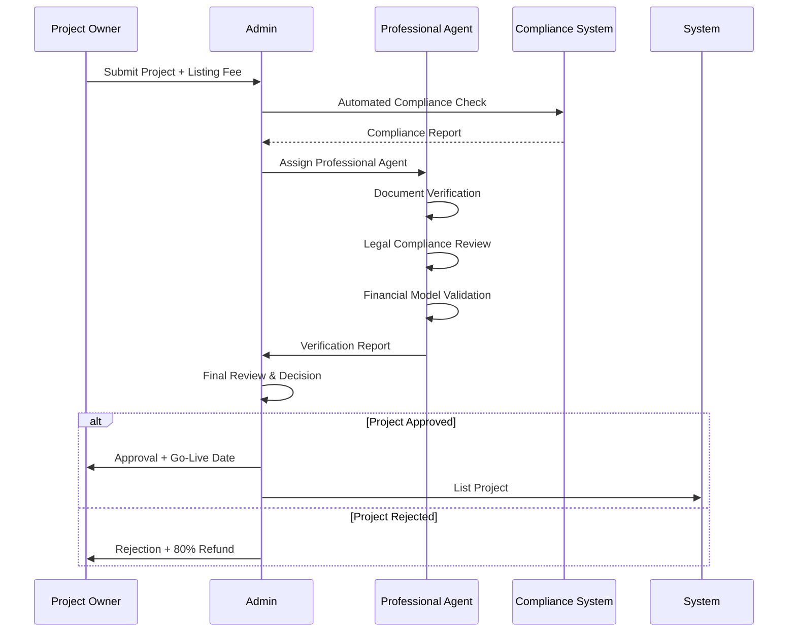
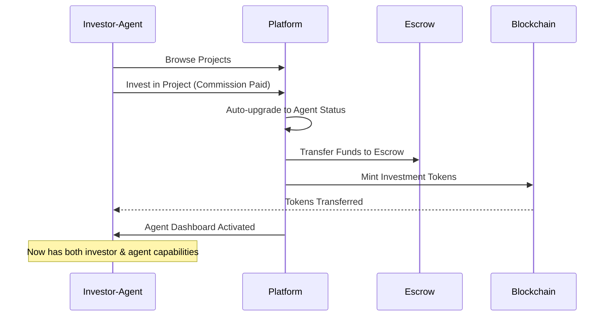
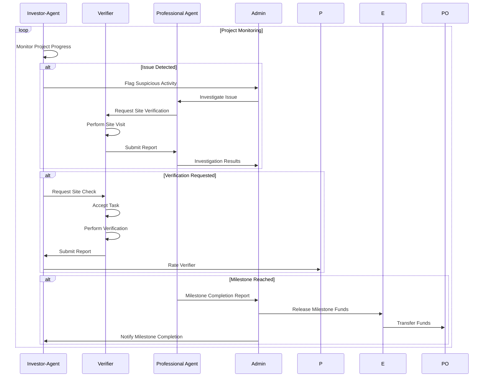
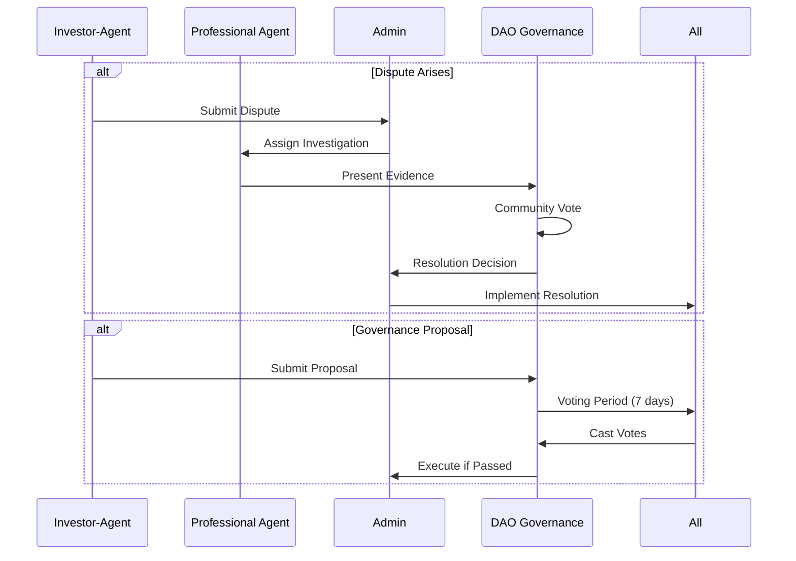

# RWA Platform: Business Model & Workflow Framework

## 💰 Revenue Model (Zero Registration Fees)

### Primary Revenue Streams

#### 1. **Investment Commission** (1-3%)
```typescript
interface InvestmentCommission {
  structure: {
    retailInvestor: "1%";      // < $10k investments
    accreditedInvestor: "2%";  // $10k - $100k investments
    institutionalInvestor: "3%"; // > $100k investments
  };
  
  collection: {
    timing: "Upon investment confirmation";
    method: "Automatic deduction from investment amount";
    distribution: {
      platform: "60%";
      professionalAgent: "25%";
      insuranceFund: "10%";
      governanceRewards: "5%";
    };
  };
  
  volume_discounts: {
    monthlyVolume_100k: "0.8x multiplier";  // 20% discount
    monthlyVolume_500k: "0.6x multiplier";  // 40% discount
    monthlyVolume_1M: "0.5x multiplier";    // 50% discount
  };
}
```

#### 2. **Project Listing Fees** ($1k-$10k)
```typescript
interface ListingFees {
  structure: {
    smallProject: {
      value: "< $500k";
      fee: "$1,000";
    };
    mediumProject: {
      value: "$500k - $5M";
      fee: "$5,000";
    };
    largeProject: {
      value: "> $5M";
      fee: "$10,000";
    };
  };
  
  usage: {
    professionalVerification: "30%";
    complianceReview: "25%";
    platformMarketing: "20%";
    technicalInfrastructure: "15%";
    operationalCosts: "10%";
  };
  
  refundPolicy: {
    rejectionRefund: "80%";  // If project rejected
    withdrawalRefund: "50%"; // If owner withdraws
    approvalRefund: "0%";    // If project approved
  };
}
```

#### 3. **Management Fees** (0.5-2% annually)
```typescript
interface ManagementFees {
  structure: {
    shortTerm: {
      duration: "< 1 year";
      fee: "0.5% annually";
    };
    mediumTerm: {
      duration: "1-3 years";
      fee: "1% annually";
    };
    longTerm: {
      duration: "> 3 years";
      fee: "2% annually";
    };
  };
  
  collection: {
    frequency: "Quarterly";
    calculation: "Based on current project valuation";
    proration: "Daily proration for partial quarters";
  };
  
  services_included: [
    "Ongoing compliance monitoring",
    "Regular asset verification",
    "Investor reporting",
    "Escrow management",
    "Dispute resolution",
    "Platform maintenance"
  ];
}
```

### Secondary Revenue Streams

#### 4. **Verification Commission** (10-20%)
```typescript
interface VerificationCommission {
  taskTypes: {
    basicSiteVisit: {
      verifierEarns: "$50-100";
      platformTakes: "15%";
    };
    detailedInspection: {
      verifierEarns: "$100-300";
      platformTakes: "20%";
    };
    expertAssessment: {
      verifierEarns: "$300-500";
      platformTakes: "10%";
    };
  };
  
  geographicPricing: {
    urban: "Base rate";
    suburban: "1.2x multiplier";
    rural: "1.5x multiplier";
    remote: "2x multiplier";
  };
  
  urgencyPricing: {
    standard: "Base rate (7 days)";
    priority: "1.5x multiplier (3 days)";
    emergency: "2x multiplier (24 hours)";
  };
}
```

#### 5. **Premium Features** ($10-100/month)
```typescript
interface PremiumFeatures {
  tiers: {
    professional: {
      price: "$29/month";
      features: [
        "Advanced analytics dashboard",
        "Custom reporting tools",
        "Priority customer support",
        "Early access to new projects",
        "Enhanced verification tools"
      ];
      targetUsers: ["Professional Agents", "High-volume Investors"];
    };
    
    enterprise: {
      price: "$99/month";
      features: [
        "White-label solutions",
        "API access",
        "Custom integrations",
        "Dedicated account manager",
        "Advanced risk analytics",
        "Bulk operations"
      ];
      targetUsers: ["Institutional Investors", "Fund Managers"];
    };
    
    power_user: {
      price: "$10/month";
      features: [
        "Advanced portfolio analytics",
        "Real-time notifications",
        "Custom alerts",
        "Export capabilities",
        "Historical data access"
      ];
      targetUsers: ["Active Investor-Agents"];
    };
  };
}
```

#### 6. **Secondary Trading Fees** (0.5-1%)
```typescript
interface SecondaryTradingFees {
  structure: {
    peerToPeer: "0.5% per side";  // 1% total
    marketMaker: "0.25% per side"; // 0.5% total
    institutionalBlock: "0.1% per side"; // 0.2% total
  };
  
  volume_discounts: {
    monthly_10k: "0.9x multiplier";
    monthly_50k: "0.8x multiplier";
    monthly_100k: "0.7x multiplier";
  };
  
  loyalty_discounts: {
    governance_participation: "Additional 10% off";
    verification_activity: "Additional 5% off";
    platform_tenure: "1% off per year (max 20%)";
  };
}
```

## 🔄 Complete Project Workflow

### Phase 1: Project Submission & Initial Review


### Phase 2: Investment & Agent Activation


### Phase 3: Ongoing Monitoring & Verification


### Phase 4: Governance & Dispute Resolution


## 📊 Financial Flow Architecture

### Revenue Collection & Distribution
```typescript
interface FinancialFlow {
  revenueCollection: {
    investment_commission: {
      trigger: "Investment confirmation";
      amount: "1-3% of investment";
      collection: "Automatic deduction";
      timing: "Immediate";
    };
    
    listing_fee: {
      trigger: "Project submission";
      amount: "$1k-10k based on size";
      collection: "Upfront payment";
      timing: "Before review";
    };
    
    management_fee: {
      trigger: "Quarterly billing";
      amount: "0.5-2% annually";
      collection: "Automated billing";
      timing: "First day of quarter";
    };
    
    verification_commission: {
      trigger: "Task completion";
      amount: "10-20% of task fee";
      collection: "Escrow release";
      timing: "Upon approval";
    };
  };
  
  distribution: {
    platform_operations: "40%";
    insurance_fund: "15%";
    agent_incentives: "20%";
    governance_rewards: "10%";
    development_fund: "10%";
    reserve_fund: "5%";
  };
}
```

### Escrow Management
```typescript
interface EscrowSystem {
  investment_escrow: {
    trigger: "Investment made";
    release_conditions: [
      "Milestone completion verified",
      "Professional agent approval",
      "No outstanding disputes",
      "Compliance requirements met"
    ];
    dispute_handling: {
      freeze_period: "72 hours";
      arbitration_process: "DAO voting";
      resolution_timeline: "14 days maximum";
    };
  };
  
  verification_escrow: {
    trigger: "Task assignment";
    release_conditions: [
      "Report submitted",
      "Quality validation passed",
      "Requester approval"
    ];
    auto_release: "7 days after submission";
  };
  
  agent_fee_escrow: {
    trigger: "Agent assignment";
    release_conditions: [
      "Verification completed",
      "Report quality approved",
      "No conflicts of interest"
    ];
    performance_bonuses: "Based on accuracy metrics";
  };
}
```

## 🎯 User Economics & Incentives

### Investor-Agent Economics
```typescript
interface InvestorAgentEconomics {
  investment_returns: {
    project_returns: "Project-specific ROI";
    governance_tokens: "Participation rewards";
    reputation_bonuses: "Accuracy-based rewards";
  };
  
  costs: {
    investment_commission: "1-3%";
    verification_requests: "$50-500 per task";
    premium_features: "$10/month (optional)";
  };
  
  incentive_alignment: {
    monitoring_rewards: "Governance tokens for flagging";
    voting_rewards: "Increased platform privileges";
    accuracy_bonuses: "Higher voting weight";
  };
}
```

### Professional Agent Economics
```typescript
interface ProfessionalAgentEconomics {
  earnings: {
    verification_commission: "2-5% of project value";
    hourly_rates: "$100-500/hour";
    milestone_bonuses: "Performance-based";
    reputation_premium: "Up to 50% rate increase";
  };
  
  costs: {
    insurance: "$2k-10k annually";
    certification: "$500-2k annually";
    platform_tools: "$29-99/month";
  };
  
  career_progression: {
    bronze_agent: "0-10 successful verifications";
    silver_agent: "11-50 successful verifications";
    gold_agent: "50+ successful verifications";
    specialist_badges: "Domain expertise recognition";
  };
}
```

### Verifier Economics
```typescript
interface VerifierEconomics {
  earnings: {
    task_fees: "$50-500 per verification";
    travel_allowance: "Distance-based compensation";
    speed_bonuses: "Quick completion rewards";
    quality_bonuses: "High-rating rewards";
  };
  
  costs: {
    transportation: "Self-funded";
    equipment: "Smartphone required";
    communication: "Data plan";
  };
  
  progression: {
    local_verifier: "Within 50km radius";
    regional_verifier: "Within 200km radius";
    traveling_verifier: "Nationwide availability";
    specialist_verifier: "Technical expertise premium";
  };
}
```

## 📈 Platform Growth Model

### Network Effects
```typescript
interface NetworkEffects {
  supply_side: {
    more_projects: "Attracts more investors";
    quality_verification: "Builds platform trust";
    professional_agents: "Enables larger projects";
  };
  
  demand_side: {
    more_investors: "Enables larger funding rounds";
    active_monitoring: "Improves project quality";
    governance_participation: "Strengthens platform";
  };
  
  cross_side: {
    investor_agents: "Create monitoring network";
    verification_quality: "Builds investor confidence";
    reputation_system: "Aligns all incentives";
  };
}
```

### Scaling Economics
```typescript
interface ScalingEconomics {
  unit_economics: {
    customer_acquisition_cost: "$50-200";
    lifetime_value: "$1k-10k";
    payback_period: "6-18 months";
    gross_margin: "70-85%";
  };
  
  operational_leverage: {
    technology_infrastructure: "Fixed costs";
    compliance_systems: "Economies of scale";
    network_effects: "Marginal cost reduction";
  };
  
  geographic_expansion: {
    jurisdiction_setup: "$50k-200k per region";
    local_partnerships: "Agent recruitment";
    regulatory_compliance: "Ongoing operational cost";
  };
}
```

This business model creates a self-sustaining ecosystem where all participants have aligned economic incentives, ensuring platform quality and growth while maintaining zero registration fees.