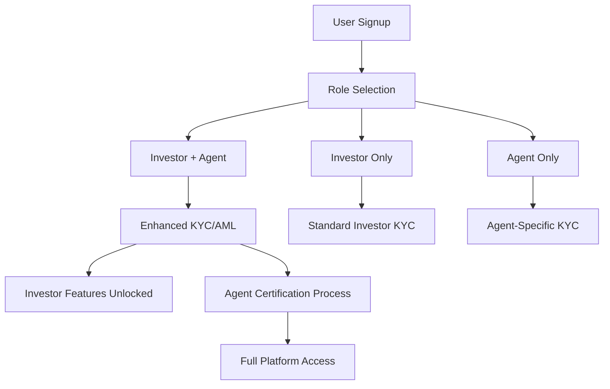
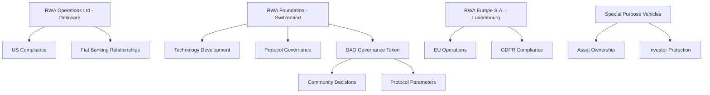

# RWA Platform: Merged Investor-Agent App Legal & Governance Framework

## 🎯 Strategic Overview

**Vision**: Transform every investor into a potential verification agent, creating a self-regulating ecosystem where participants have skin in the game for accurate asset verification.

**Key Insight**: Investors who can also verify assets have stronger incentives for accuracy, reducing information asymmetry and increasing trust in the platform.

## 🏗️ Merged App Architecture

### Dual-Role User Journey


### App Feature Matrix
```typescript
interface UserCapabilities {
  investor: {
    browsing: boolean;
    investing: boolean;
    portfolioManagement: boolean;
    secondaryTrading: boolean;
  };
  agent: {
    jobAcceptance: boolean;
    assetInspection: boolean;
    reportSubmission: boolean;
    disputeResolution: boolean;
    peerReview: boolean;
  };
  governance: {
    voting: boolean;
    proposalCreation: boolean;
    parameterChanges: boolean;
  };
}
```

## ⚖️ Legal Compliance Framework

### 1. **Regulatory Classification System**

```typescript
enum UserClass {
  RETAIL_INVESTOR = "retail_investor",           // Basic investment rights
  ACCREDITED_INVESTOR = "accredited_investor",   // Higher investment limits
  PROFESSIONAL_AGENT = "professional_agent",     // Certified verification agent
  HYBRID_PARTICIPANT = "hybrid_participant"      // Investor + Agent dual role
}

interface ComplianceRequirements {
  [UserClass.RETAIL_INVESTOR]: {
    kycLevel: "basic";
    investmentLimit: 10000; // USD
    agentCapabilities: false;
    documentation: ["passport", "proof_of_address"];
  };
  [UserClass.ACCREDITED_INVESTOR]: {
    kycLevel: "enhanced";
    investmentLimit: 1000000;
    agentCapabilities: "optional";
    documentation: ["passport", "proof_of_address", "income_verification"];
  };
  [UserClass.PROFESSIONAL_AGENT]: {
    kycLevel: "professional";
    investmentLimit: 50000;
    agentCapabilities: true;
    documentation: ["passport", "professional_license", "insurance", "background_check"];
  };
  [UserClass.HYBRID_PARTICIPANT]: {
    kycLevel: "enhanced_professional";
    investmentLimit: 500000;
    agentCapabilities: true;
    documentation: ["passport", "proof_of_address", "professional_certification", "insurance"];
  };
}
```

### 2. **Jurisdictional Compliance Matrix**

```typescript
interface JurisdictionRules {
  [jurisdiction: string]: {
    allowedUserClasses: UserClass[];
    investmentLimits: Record<UserClass, number>;
    agentLicenseRequired: boolean;
    dataResidencyRules: DataResidencyRule[];
    taxReportingRequirements: TaxRule[];
  };
}

const jurisdictionCompliance: JurisdictionRules = {
  "US": {
    allowedUserClasses: [UserClass.ACCREDITED_INVESTOR, UserClass.PROFESSIONAL_AGENT],
    investmentLimits: {
      [UserClass.ACCREDITED_INVESTOR]: 1000000,
      [UserClass.PROFESSIONAL_AGENT]: 50000
    },
    agentLicenseRequired: true,
    dataResidencyRules: ["LOCAL_STORAGE_REQUIRED"],
    taxReportingRequirements: ["1099_FORMS", "FBAR_REPORTING"]
  },
  "EU": {
    allowedUserClasses: [UserClass.RETAIL_INVESTOR, UserClass.HYBRID_PARTICIPANT],
    investmentLimits: {
      [UserClass.RETAIL_INVESTOR]: 10000,
      [UserClass.HYBRID_PARTICIPANT]: 500000
    },
    agentLicenseRequired: false,
    dataResidencyRules: ["GDPR_COMPLIANCE"],
    taxReportingRequirements: ["DAC6_REPORTING"]
  }
  // Add more jurisdictions...
};
```

### 3. **Legal Documentation System**

```typescript
interface LegalDocumentFramework {
  userAgreements: {
    investorTerms: string;        // Investment-specific terms
    agentTerms: string;           // Agent-specific terms  
    hybridTerms: string;          // Combined investor-agent terms
    privacyPolicy: string;        // Data protection
    riskDisclosure: string;       // Investment risks
  };
  
  compliance: {
    kycPolicies: string;          // Know Your Customer procedures
    amlPolicies: string;          // Anti-Money Laundering
    conflictOfInterest: string;   // Dual-role conflict management
    disputeResolution: string;    // Arbitration procedures
  };
  
  operational: {
    verificationStandards: string; // Agent verification requirements
    qualityAssurance: string;     // Report quality standards
    insuranceRequirements: string; // Professional liability
    dataRetention: string;        // Document storage policies
  };
}
```

## 🏛️ Governance Structure

### 1. **Decentralized Autonomous Organization (DAO)**

```typescript
interface RWAGovernance {
  structure: {
    // Token-weighted voting with caps to prevent whale dominance
    votingPower: {
      maxTokenWeight: 0.05;      // Max 5% voting power per participant
      reputationMultiplier: 1.5;  // Reputation boosts voting power
      stakingRequirement: 1000;   // Minimum tokens to vote
    };
    
    // Multi-tier proposal system
    proposalTypes: {
      "PARAMETER_CHANGE": {
        threshold: 0.51;          // Simple majority
        timelock: 24 * 60 * 60;   // 24 hour delay
        examples: ["fee_rates", "staking_requirements"];
      };
      "PROTOCOL_UPGRADE": {
        threshold: 0.66;          // Supermajority
        timelock: 7 * 24 * 60 * 60; // 7 day delay
        examples: ["smart_contract_upgrades", "consensus_changes"];
      };
      "LEGAL_COMPLIANCE": {
        threshold: 0.75;          // Strong majority
        timelock: 14 * 24 * 60 * 60; // 14 day delay
        examples: ["jurisdiction_changes", "kyc_requirements"];
      };
    };
  };
}
```

### 2. **Legal Entity Structure**



### 3. **Conflict of Interest Management**

```typescript
interface ConflictManagement {
  dualRoleProtections: {
    // Prevent agents from verifying their own investments
    selfVerificationBan: boolean;
    
    // Cooling-off periods between roles
    roleTransitionCooldown: number; // 30 days
    
    // Disclosure requirements
    disclosureRequirements: {
      assetOwnership: boolean;
      financialInterest: boolean;
      personalRelationships: boolean;
    };
    
    // Algorithmic assignment to prevent conflicts
    agentAssignment: {
      geographicSeparation: number;   // Min 100km from agent location
      financialIndependence: boolean; // No investments in same asset class
      randomizedAssignment: boolean;  // Algorithm prevents gaming
    };
  };
  
  oversight: {
    independentReview: boolean;       // Random audit of agent reports
    peerValidation: boolean;          // Multiple agents per asset
    reputationStaking: boolean;       // Economic skin in the game
  };
}
```

## 📋 Documentation & Compliance System

### 1. **Smart Documentation Architecture**

```typescript
interface DocumentationSystem {
  legalDocs: {
    // Jurisdiction-specific documents
    byJurisdiction: {
      [jurisdiction: string]: {
        investorAgreement: IPFSHash;
        agentAgreement: IPFSHash;
        privacyPolicy: IPFSHash;
        riskDisclosure: IPFSHash;
      };
    };
    
    // Role-specific documents  
    byRole: {
      [UserClass.HYBRID_PARTICIPANT]: {
        conflictDisclosure: IPFSHash;
        dualRoleAgreement: IPFSHash;
        insuranceRequirements: IPFSHash;
      };
    };
    
    // Dynamic compliance documents
    compliance: {
      kycRequirements: IPFSHash;
      amlProcedures: IPFSHash;
      sanctionsScreening: IPFSHash;
    };
  };
  
  operationalDocs: {
    verificationStandards: IPFSHash;
    qualityMetrics: IPFSHash;
    disputeProcedures: IPFSHash;
    trainingMaterials: IPFSHash;
  };
}
```

### 2. **Automated Compliance Engine**

```typescript
class ComplianceEngine {
  async validateUserOnboarding(user: UserRegistration): Promise<ComplianceResult> {
    const jurisdiction = await this.detectJurisdiction(user.location);
    const requirements = jurisdictionCompliance[jurisdiction];
    
    // Check if user's desired roles are allowed
    if (!requirements.allowedUserClasses.includes(user.desiredRole)) {
      return {
        status: 'REJECTED',
        reason: `Role ${user.desiredRole} not permitted in ${jurisdiction}`
      };
    }
    
    // Validate investment limits
    if (user.plannedInvestment > requirements.investmentLimits[user.desiredRole]) {
      return {
        status: 'REJECTED', 
        reason: 'Investment amount exceeds jurisdictional limits'
      };
    }
    
    // Generate required documents
    const requiredDocs = await this.generateRequiredDocuments(jurisdiction, user.desiredRole);
    
    return {
      status: 'APPROVED',
      requiredDocuments: requiredDocs,
      kycLevel: requirements.kycLevel
    };
  }
  
  async generateRequiredDocuments(jurisdiction: string, role: UserClass): Promise<Document[]> {
    const baseTemplate = await this.getDocumentTemplate(jurisdiction, role);
    
    // Customize documents based on role and jurisdiction
    const customizedDocs = await this.customizeDocuments(baseTemplate, {
      jurisdiction,
      role,
      timestamp: Date.now(),
      regulatoryVersion: this.getCurrentRegulatoryVersion()
    });
    
    // Store on IPFS for immutability
    const ipfsHashes = await this.storeOnIPFS(customizedDocs);
    
    return customizedDocs.map((doc, index) => ({
      type: doc.type,
      content: doc.content,
      ipfsHash: ipfsHashes[index],
      requiresSignature: doc.requiresSignature
    }));
  }
}
```

### 3. **Regulatory Reporting Framework**

```typescript
interface RegulatoryReporting {
  automated: {
    // Automated compliance reporting
    transactionReporting: {
      threshold: 10000;          // Report transactions > $10k
      frequency: "daily";
      format: "XML";
      recipients: ["FinCEN", "local_regulator"];
    };
    
    // Suspicious activity monitoring
    amlMonitoring: {
      patterns: ["unusual_volumes", "rapid_transactions", "geographic_risks"];
      alertThreshold: 0.8;       // 80% confidence for alerts
      reportingDelay: 24;        // Hours to file SAR
    };
    
    // User activity reporting
    kycReporting: {
      newUserReports: "monthly";
      statusChangeReports: "immediate";
      auditTrails: "continuously";
    };
  };
  
  manual: {
    // Quarterly compliance reports
    quarterlyReports: {
      userGrowth: boolean;
      transactionVolumes: boolean;
      jurisdictionalBreakdown: boolean;
      incidentReports: boolean;
    };
    
    // Annual audits
    annualAudits: {
      financialAudit: boolean;
      securityAudit: boolean;
      complianceAudit: boolean;
      smartContractAudit: boolean;
    };
  };
}
```

## 🛡️ Risk Management & Insurance

### 1. **Professional Liability Framework**

```typescript
interface AgentInsurance {
  requirements: {
    minimumCoverage: 1000000;     // $1M minimum coverage
    coverageTypes: [
      "professional_liability",
      "errors_omissions", 
      "cyber_liability"
    ];
    
    // Dynamic coverage based on verification value
    scaledCoverage: {
      assetValueTiers: {
        "0-100000": { coverage: 1000000 };
        "100000-1000000": { coverage: 5000000 };
        "1000000+": { coverage: 10000000 };
      };
    };
  };
  
  verification: {
    insuranceValidation: boolean;
    annualRenewal: boolean;
    claimsHistoryCheck: boolean;
  };
}
```

### 2. **Platform Risk Mitigation**

```typescript
interface PlatformRiskMitigation {
  agentQuality: {
    // Multi-layer verification system
    initialCertification: {
      trainingRequirement: 40;   // Hours of training
      examinationPass: 0.8;     // 80% pass rate required
      backgroundCheck: boolean;
      referenceChecks: 3;       // Professional references
    };
    
    // Ongoing quality assurance
    continuousMonitoring: {
      peerReview: boolean;       // Random peer reviews
      clientFeedback: boolean;   // Investor feedback systems
      algorithmicDetection: boolean; // AI-powered quality detection
    };
    
    // Performance-based certification levels
    certificationTiers: {
      "BRONZE": { minReports: 10, accuracy: 0.9 };
      "SILVER": { minReports: 50, accuracy: 0.95 };
      "GOLD": { minReports: 200, accuracy: 0.98 };
    };
  };
  
  financialRisks: {
    // Platform insurance fund
    insuranceFund: {
      contributionRate: 0.005;   // 0.5% of transaction fees
      minimumBalance: 10000000;  // $10M minimum
      maxClaimPerIncident: 5000000; // $5M max claim
    };
    
    // Investor protection
    investorProtection: {
      segregatedAccounts: boolean;
      trusteeManagement: boolean;
      auditedCustody: boolean;
    };
  };
}
```

## 🚀 Implementation Strategy

### Phase 1: Legal Foundation (Weeks 1-4)
```typescript
interface LegalFoundationTasks {
  entitySetup: [
    "Establish Swiss Foundation",
    "Register Delaware C-Corp", 
    "Set up Luxembourg S.A.",
    "Create SPV templates"
  ];
  
  complianceFramework: [
    "Draft jurisdiction compliance matrix",
    "Create automated compliance engine",
    "Establish regulatory reporting system",
    "Set up legal document management"
  ];
  
  insuranceProgram: [
    "Negotiate platform insurance",
    "Create agent insurance requirements",
    "Establish claims procedures",
    "Set up verification processes"
  ];
}
```

### Phase 2: App Merger (Weeks 5-8)
```typescript
interface AppMergerTasks {
  uiDesign: [
    "Create role selection onboarding",
    "Design dual-role dashboard",
    "Implement conflict of interest warnings",
    "Add compliance status indicators"
  ];
  
  backend: [
    "Merge user role systems",
    "Implement conflict detection algorithms", 
    "Add automated document generation",
    "Create compliance monitoring system"
  ];
  
  testing: [
    "User acceptance testing",
    "Compliance workflow testing",
    "Legal document validation",
    "Performance testing"
  ];
}
```

### Phase 3: Regulatory Approval (Weeks 9-12)
```typescript
interface RegulatoryApprovalTasks {
  documentation: [
    "Submit regulatory applications",
    "Provide platform documentation",
    "Demonstrate compliance systems",
    "Address regulator feedback"
  ];
  
  pilotProgram: [
    "Launch closed beta",
    "Test with select jurisdictions",
    "Gather compliance data",
    "Refine processes"
  ];
  
  auditAndCertification: [
    "Third-party security audit",
    "Compliance certification",
    "Smart contract audit",
    "Insurance verification"
  ];
}
```

This framework creates a legally compliant, self-regulating ecosystem where every participant has aligned incentives for accurate asset verification while maintaining regulatory compliance across multiple jurisdictions.